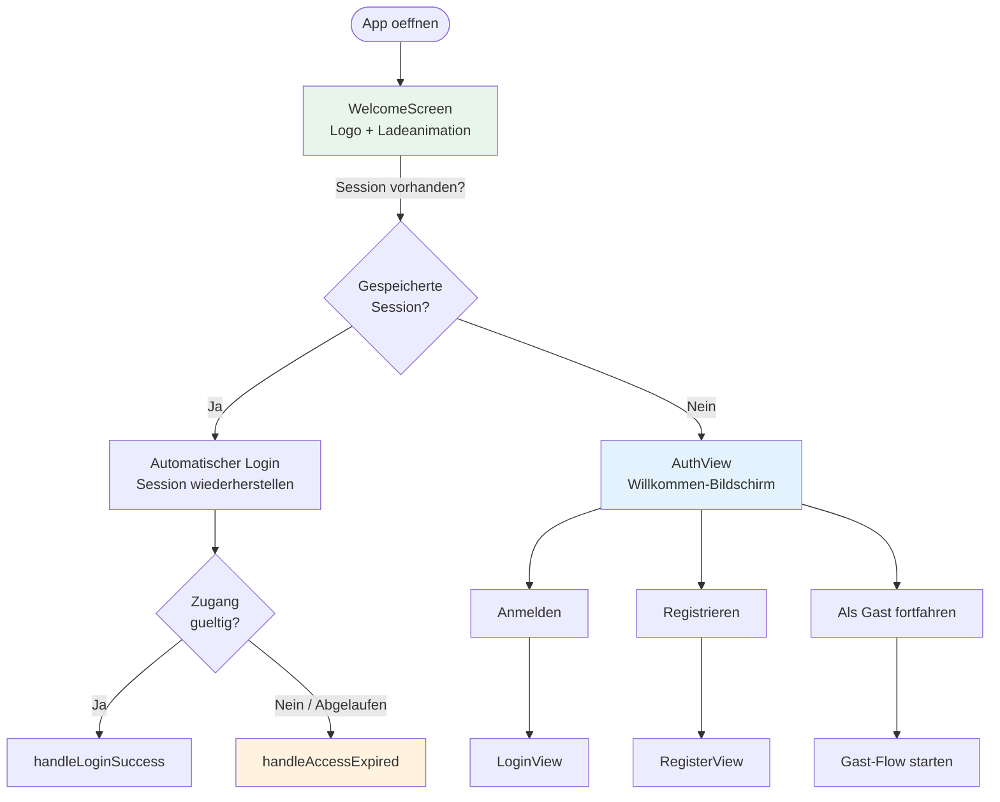
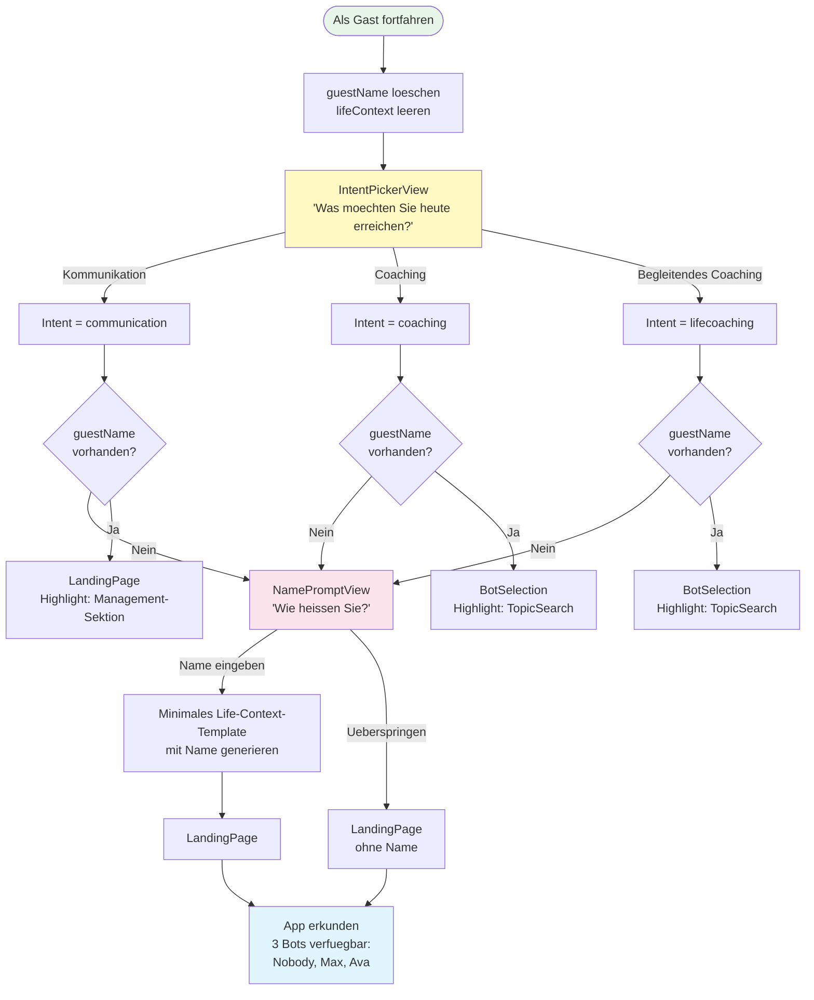
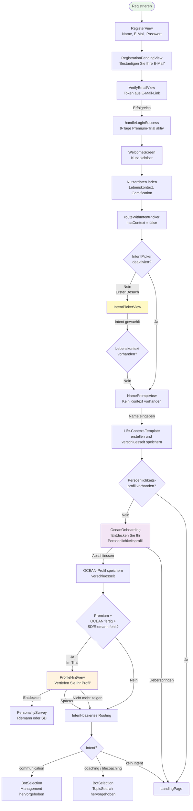
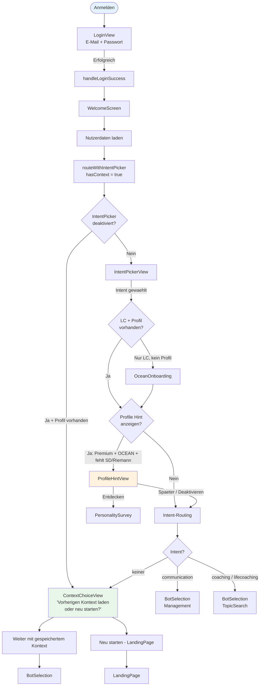
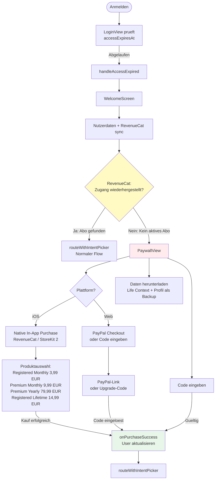
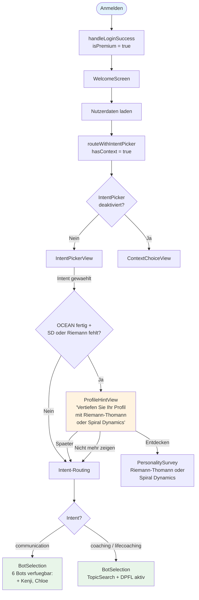
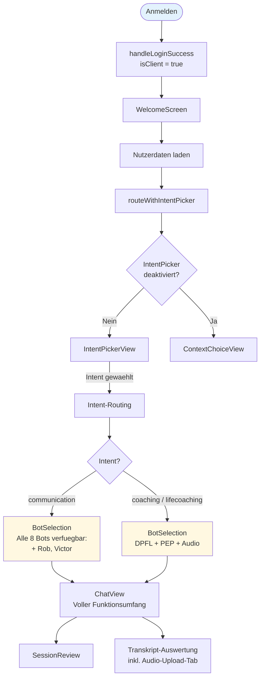
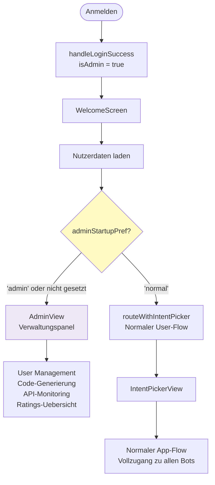
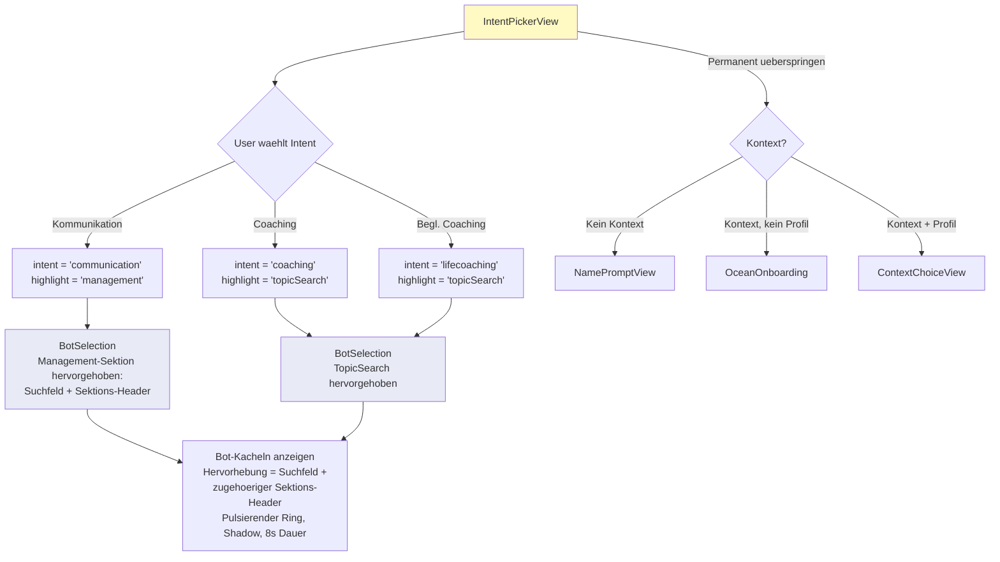
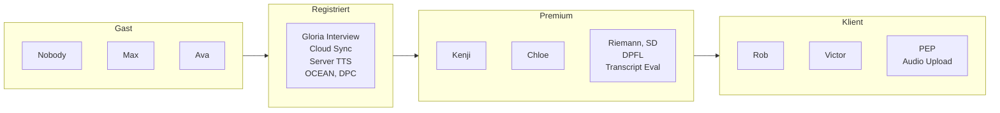

# UX Flows — Meaningful Conversations v1.9.9

Dieses Dokument beschreibt die User Experience fuer alle Benutzertypen als visuelle Flow-Diagramme.

**Zuletzt aktualisiert:** 27. Februar 2026

---

## Uebersicht der Benutzertypen

| Typ | Beschreibung | Einstieg |
|:---|:---|:---|
| **Gast** | Unregistriert, Daten nur lokal | "Als Gast fortfahren" |
| **Registriert (Neu)** | Frisch registriert, 9-Tage Premium-Trial | Registrierung + E-Mail-Verifizierung |
| **Registriert (Wiederkehrend)** | Hat Lebenskontext + Profil | Login |
| **Registriert (Trial abgelaufen)** | 9-Tage-Trial vorbei, kein Kauf | Login → Paywall |
| **Premium** | Aktives Abo oder Pass | Login |
| **Klient** | Coaching-Klient bei manualmode.at | Login (vom Coach freigeschaltet) |
| **Admin / Developer** | Verwaltungszugang | Login → Admin-Panel |

---

## Screenshots (Guest-Flow)

Die folgenden Screenshots dokumentieren den vollstaendigen Guest-Flow der Web-Version:

| Nr. | Bildschirm | Datei |
|:---|:---|:---|
| 1 | AuthView (Willkommen) | `screenshots/01-auth-welcome.png` |
| 2 | IntentPickerView | `screenshots/02-intent-picker.png` |
| 3 | NamePromptView | `screenshots/03-name-prompt.png` |
| 4 | LandingPage (mit Life-Context-Template) | `screenshots/04-landing-page-guest.png` |
| 5 | BotSelection (Management + Coaching) | `screenshots/05-bot-selection-guest.png` |
| 6 | BotSelection (Gesperrte Premium-Bots) | `screenshots/06-bot-selection-locked.png` |
| 7 | BotSelection (Klienten-Sektion) | `screenshots/07-bot-selection-client-locked.png` |

---

## 1. App-Start (alle User)



---

## 2. Gast-Flow



### Gast: Verfuegbare Features

| Feature | Verfuegbar | Hinweis |
|:---|:---:|:---|
| Chat mit Nobody, Max, Ava | Ja | Vollwertiges Coaching |
| Voice Mode (Web Speech) | Ja | Browser-TTS |
| Server TTS (hohe Qualitaet) | Nein | Nur registriert |
| Lebenskontext | Ja | Nur lokal im Browser |
| Persoenlichkeitsprofil | Nein | Registrierung noetig |
| Cloud-Sync | Nein | Daten gehen bei Browser-Reset verloren |
| Coach-Empfehlung | Nein | Anmelde-Hinweis stattdessen |

---

## 3. Registrierung (Neuer User)



---

## 4. Login: Wiederkehrender Registrierter User



---

## 5. Login: Trial abgelaufen (Paywall)



### Paywall: Produktuebersicht

| Produkt | iOS (IAP) | Web (PayPal) | Tier |
|:---|---:|---:|:---|
| Registered Monthly | 3,99 EUR/Mo | 3,90 EUR/Mo | Registered |
| Registered Lifetime | 14,99 EUR | 14,90 EUR | Registered (permanent) |
| Premium Monthly | 9,99 EUR/Mo | 9,90 EUR/Mo | Premium |
| Premium Yearly | 79,99 EUR/Jr | 79,90 EUR/Jr | Premium |
| Kenji Unlock | 3,99 EUR | 3,90 EUR | Einzelbot |
| Chloe Unlock | 3,99 EUR | 3,90 EUR | Einzelbot |

---

## 6. Premium User



### Premium: Zusaetzliche Features (gegenueber Registered)

| Feature | Registriert | Premium |
|:---|:---:|:---:|
| Kenji (Stoisch) | Gesperrt | Freigeschaltet |
| Chloe (Strukturierte Reflexion) | Gesperrt | Freigeschaltet |
| Riemann-Thomann Profil | Gesperrt | Freigeschaltet |
| Spiral Dynamics Profil | Gesperrt | Freigeschaltet |
| DPFL (Adaptive Learning) | Gesperrt | Freigeschaltet |
| Comfort Check | Gesperrt | Freigeschaltet |
| Transkript-Auswertung | Gesperrt | Freigeschaltet |
| Transkript-PDF-Export | Gesperrt | Freigeschaltet |

---

## 7. Klient



### Klient: Exklusive Features

| Feature | Nur Klient |
|:---|:---|
| Rob (Mentale Fitness) | Exklusiv |
| Victor (Systemisch) | Exklusiv |
| PEP Loesungsblockaden | Exklusiv |
| Audio-Transkription (Upload) | Exklusiv |

---

## 8. Admin / Developer



### Visual Redesign (Brand-Driven Design System)
Seit v1.9.6 nutzt die App ein markengesteuertes Design-System mit White-Label-Unterstuetzung:
- **Farben:** 4-stufige Markenpallette + Akzentfarbe (definiert über CSS-Variablen, per Brand konfigurierbar).
- **Typografie:** Inter Variable Font.
- **Komponenten:** Abgerundete Karten, schwebende Schatten, Pill-Buttons.
- **Animationen:** Framer Motion für weiche Übergänge.
- **White-Label:** W4F (Work4Flow) als erste Zusatzmarke mit eigenem Farbschema und Loader.

Admins und Developer koennen in den Einstellungen (`AdminView`) waehlen:
- **Admin-Panel** (Standard): Direkt zum Verwaltungsbereich
- **Normaler Start**: Wie ein regulaerer User mit Intent Picker

Die Praeferenz wird in `localStorage.adminStartupPref` gespeichert.

---

## 9. Intent-basiertes Routing (Detail)



### Intent-Beschreibungen

| Intent | Deutsch | Englisch | Ziel-Sektion |
|:---|:---|:---|:---|
| Kommunikation | "Bereiten Sie schwierige Gespraeche vor" | "Prepare for difficult conversations" | Management & Kommunikation |
| Coaching | "Arbeiten Sie an Ihren persoenlichen Zielen" | "Work on your personal goals" | TopicSearch (Coaching) |
| Begleitendes Coaching | "Professionelles Coaching mit KI-Unterstuetzung" | "Professional coaching with AI support" | TopicSearch (Coaching) |

---

## 10. Onboarding-Komponenten (Detail)

### 10.1 IntentPickerView

- **Anzeige:** Drei Karten mit Icon, Titel, Beschreibung
- **"Nicht mehr anzeigen":** Setzt `intentPickerDisabled = true` in localStorage
- **Positionierung:** Zentriert, etwas tiefer als Bildschirmmitte
- **Animation:** Framer Motion fade-in

### 10.2 NamePromptView

- **Fuer Gaeste:** Name optional (Ueberspringen moeglich), wird in `localStorage.guestName` gespeichert
- **Fuer Registrierte:** Name erforderlich (kein Ueberspringen), wird in verschluesselten Lebenskontext integriert
- **Template:** Generiert minimales Life-Context-Template mit allen Ueberschriften (auch wenn nur Name ausgefuellt)
- **Anzeige:** Wenn bereits ein Lebenskontext existiert, wird der Name nicht erneut abgefragt

### 10.3 OceanOnboarding

- **Trigger:** Registrierte User ohne Persoenlichkeitsprofil
- **Inhalt:** Kurzversion des Big-5 (OCEAN) Fragebogens
- **Ergebnis:** Verschluesseltes Profil wird gespeichert
- **Ueberspringen:** Moeglich, fuehrt direkt zur LandingPage

### 10.4 ProfileHintView

- **Trigger:** Premium-User mit OCEAN-Profil, aber ohne Spiral Dynamics ODER Riemann-Thomann
- **Optionen:**
  - "Entdecken" → PersonalitySurvey (Riemann oder SD)
  - "Spaeter" → Weiter zum Intent-Routing
  - "Nicht mehr zeigen" → `profileHintDisabled = true`, weiter zum Intent-Routing
- **Badge:** Burger-Menue zeigt Benachrichtigungs-Badge solange ProfileHint aktiv

---

## 10.5 Gloria Interview Flow (v1.8.9+)

```mermaid
flowchart TD
    START([BotSelection]) --> BTN[Gloria Interview waehlen]
    BTN --> CHAT[ChatView<br/>Bot: gloria-interview]
    
    CHAT --> INTRO[Bot: Fragt nach Thema und Dauer]
    INTRO --> USER[User: Definiert Thema]
    USER --> INTERVIEW[Interview-Phase<br/>Strukturierte Fragen]
    
    INTERVIEW --> END[Sitzung beenden]
    END --> REVIEW[SessionReview<br/>isInterviewReview = true]
    
    REVIEW --> TABS{Ansicht}
    TABS -->|Zusammenfassung| SUMMARY[Zusammenfassung<br/>des Themas]
    TABS -->|Setup| SETUP[Metadaten:<br/>Thema, Dauer, Fokus]
    TABS -->|Transkript| TRANSCRIPT[Geglaettetes Transkript<br/>(Interviewer / User)]
    
    TRANSCRIPT --> EXPORT[Als Markdown exportieren]
    EXPORT --> DASHBOARD[Zurueck zum Dashboard]
```

### Gloria Interview
Ein spezialisierter Flow für strukturierte Interviews ohne Coaching-Ratschläge.
- **Einstieg:** Über die "Management & Kommunikation"-Sektion in der BotSelection.
- **Bot:** `gloria-interview` (nicht zu verwechseln mit `gloria-life-context`).
- **Output:** Ein grammatikalisch geglättetes Transkript und eine strukturierte Zusammenfassung, ideal für Brainstorming oder Projektplanung.

```
┌─────────────────────────────────────────────────────────────────────────────┐
│                        BILDSCHIRM-ABFOLGE                                   │
├──────────┬──────────┬──────────┬──────────┬──────────┬──────────┬───────────┤
│  Schritt │   Gast   │ Reg.Neu  │ Reg.Wied.│ Expired  │ Premium  │  Admin    │
├──────────┼──────────┼──────────┼──────────┼──────────┼──────────┼───────────┤
│    1     │ Auth     │ Auth     │ Auth     │ Auth     │ Auth     │ Auth      │
│    2     │ —        │ Register │ Login    │ Login    │ Login    │ Login     │
│    3     │ —        │ Pending  │ Welcome  │ Welcome  │ Welcome  │ Welcome   │
│    4     │ Intent   │ Verify   │ Intent*  │ RC Sync  │ Intent*  │ Admin**   │
│    5     │ Name*    │ Welcome  │ Context  │ Paywall  │ Hint*    │ —         │
│    6     │ Landing  │ Intent   │ BotSel.  │ Kauf     │ BotSel.  │ —         │
│    7     │ BotSel.  │ Name     │ Chat     │ Intent   │ Chat     │ —         │
│    8     │ Chat     │ OCEAN*   │ —        │ ...      │ —        │ —         │
│    9     │ —        │ Hint*    │ —        │ —        │ —        │ —         │
│   10     │ —        │ BotSel.  │ —        │ —        │ —        │ —         │
│   11     │ —        │ Chat     │ —        │ —        │ —        │ —         │
├──────────┴──────────┴──────────┴──────────┴──────────┴──────────┴───────────┤
│  * = optional/uebersprungbar    ** = oder normaler Flow je nach Praeferenz  │
└─────────────────────────────────────────────────────────────────────────────┘
```

---

## 11. Bot-Zugang nach Tier



---

## 12. Plattform-Unterschiede: iOS vs. Web

| Aspekt | iOS (Capacitor) | Web (Browser) |
|:---|:---|:---|
| Installation | App Store Download | PWA zum Homescreen |
| Zahlungen | In-App Purchase (RevenueCat) | PayPal Direct Checkout |
| PayPal-Links | Ausgeblendet (Apple 3.1.1) | Sichtbar |
| TTS | Native iOS Stimmen | Server TTS (Piper, ab Registered) + Web Speech API Fallback |
| STT | Native Speech Recognition | Web Speech API |
| Safe Area | Dynamic Island / Notch beruecksichtigt | Standard-Padding |
| Datenexport | Ueber Share-Sheet | Browser-Download |
| PII-Warnung | Angepasste Textgroesse fuer Mobilbildschirm | Standard |

---

*Dieses Dokument basiert auf dem implementierten Code in `App.tsx` (v1.9.9) und spiegelt die tatsaechliche Routing-Logik wider.*
